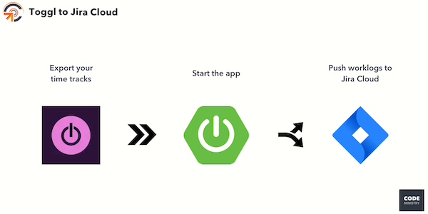

[](https://gitlab.com/codeministry-oss/toogle-to-jira/commits/master)
[](https://gitlab.com/codeministry-oss/toogle-to-jira/-/tags)
[](https://gitlab.com/codeministry-oss/toogle-to-jira/-/commits)
[](https://gitlab.com/codeministry-oss/toogle-to-jira/-/blob/master/LICENSE)
[](https://codeministry.de)

# Toggl to Jira Cloud

### Import your toggl time tracks to as worklogs into Jira Cloud



As a freelancer, I like to use [toggl](https://track.toggl.com) to track my hours. Many of the projects I am involved in use Jira as project software. Therefore,<br>
I was looking for a simple way to transfer my hours quickly and easily as a worklog to Jira. I use the generated Jira key (e.g. `SLY-242`), <br>
which every task and story has, as a unique identification key in the description of the toggl entry.

[](https://track.toggl.com)

### How to import your time trackings?

1. Login in Jira Cloud and create a personal API token here: https://id.atlassian.com/manage-profile/security/api-tokens .

[](https://id.atlassian.com/manage-profile/security/api-tokens)

2. Change config in `application.yml` fitting you project and customers settings:
``` 
url: https://your-project.atlassian.net
user-email: you@your-company.com
api-token: some-cryptic-api-token
```

3. Export time entries as csv file from toggl (use "Detailed Report") to `resources/csv/time-entries.csv`.

[](https://track.toggl.com)

Example data:
```
User,Email,Client,Project,Task,Description,Billable,Start date,Start time,End date,End time,Duration,Tags,Amount ()
Max,max@musterman.com,the client,your project,,STC-198 The task description,No,2021-04-07,09:25:02,2021-04-07,10:00:07,00:35:05,,
```

4. Set `toggl-to-jira.settings.active: false` in `application.yml` - So you can start a "dry run" first and test the output of your data without pushing them immediately to Jira.

5. If everything is ok set `toggl-to-jira.settings.active: true` and start the application. It will automatically start a `CommandLineRunner` and process the data.

6. Check the worklogs in the Jira Cloud.

#### ToDos:
- "dockerize" app, incl. external file handling
- add tests oO
- more configuration to fit: e.g. CSV format, Jira settings, etc. 
- more documentations & README
- maybe use toggl tags?
- add more project platforms? 

#### OpenSource
This is open source software. Use on your own risk and for personal use. If you need support or consultancy just contact [me](https://codeministry.de).

[](https://codeministry.de)
